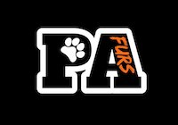

# Pennsylvania Furries Website

This is a GitHub repo tracking the documents for the website hosted at [http://www.pa-furry.org/](http://www.pa-furry.org/).

## Development Instructions

- `npm install http-server -g`
- `http-server`
- [http://127.0.0.1:8080/](http://127.0.0.1:8080/)
- `./go.sh` - If you're me, this will sync the current directory to the AWS S3 bucket hosting the website.  If you're not me, don't do this. :-)
   - If you're me, you also may need to invalidate the cache in CloudFront.

## Who built this? / Contact

My name is Douglas Muth, and I am a software engineer in Philadelphia, PA.

There are several ways to get in touch with me:
- Email to doug.muth AT gmail DOT com or dmuth AT dmuth DOT org
- [Facebook](https://facebook.com/dmuth) and [Twitter](http://twitter.com/dmuth)
- [LinkedIn](http://localhost:8080/www.linkedin.com/in/dmuth)

Feel free to reach out to me if you have any comments, suggestions, or bug reports.

